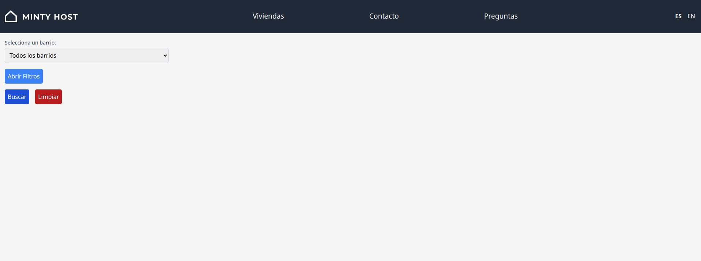
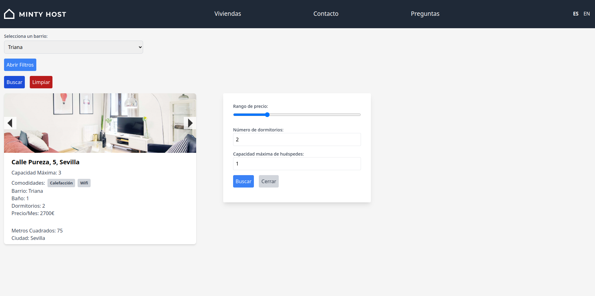

# Search Apartments

This project is a program search for Apartments of differents places.

This is my first project in Vue, I used Option and Composition API, Pinia, API Requests and Reactivity.

## Recommended IDE Setup

[VSCode](https://code.visualstudio.com/) + [Volar](https://marketplace.visualstudio.com/items?itemName=Vue.volar) (and disable Vetur) + [TypeScript Vue Plugin (Volar)](https://marketplace.visualstudio.com/items?itemName=Vue.vscode-typescript-vue-plugin).

## Customize configuration

See [Vite Configuration Reference](https://vitejs.dev/config/).

## Project Setup

```sh
npm install
```

### Compile and Hot-Reload for Development

```sh
npm run dev
```

### Compile and Minify for Production

```sh
npm run build
```
## Pages and Functionalities

- **Home:** Main Page when starting project, we can search all or specific one neighborhood or filter them.


- **Search All:** The user can search all neighborhoods.


- **Filter All:** The user filter all neighborhoods.


- **Search One:** The user can search one neighborhood.


- **Filter One:** The user can filter one neighborhood.


## Other Techs Used

- Tailwind CSS